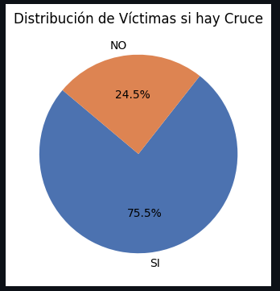
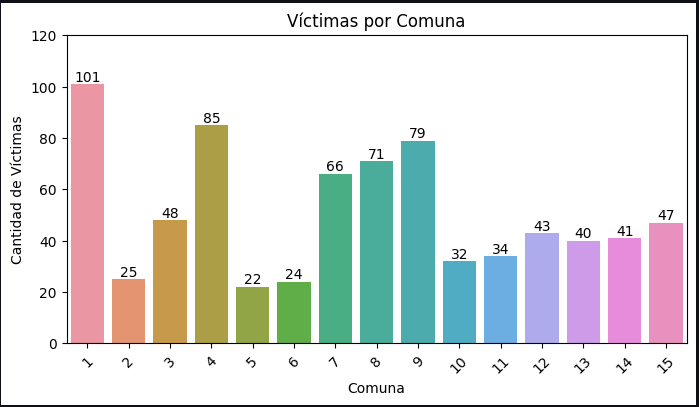
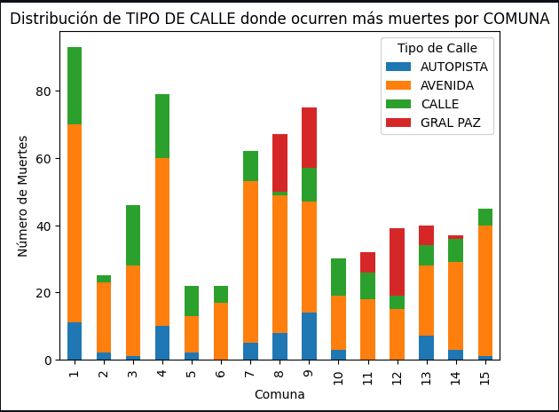
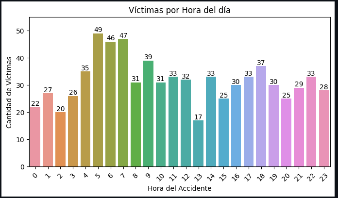
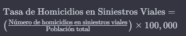
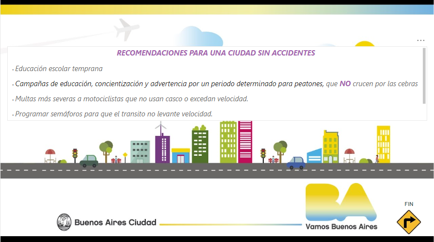

# <h1 align=center> **PROYECTO INDIVIDUAL Nº2** </h1>

# <h1 align=center> **Siniestros Viales en la Ciudad de Buenos Aires con víctimas fatales (2016-2021)** </h1>

<hd>

 

    

# <h1 align=center> **Siniestros Viales en CABA con víctimas fatales (2016-2021)** </h1>

## **INTRODUCCION**🚻

En el presente trabajo, asumí el rol de Data Analyst con el propósito de elaborar un informe de análisis de datos solicitado por el Observatorio de Movilidad y Seguridad Vial (OMSV), adscrito a la Secretaría de Transporte del Gobierno de la Ciudad Autónoma de Buenos Aires (CABA).

El OMSV tiene como objetivo a mediano plazo reducir en un 20% las víctimas fatales por siniestros viales para el año 2023 y en un 50% para 2030. Este centro de estudios de alta eficiencia amplió su alcance desde 2020, incluyendo informes sobre la Movilidad en la Ciudad. El plan en marcha fomenta la colaboración entre la parte pública, privada y sociedad civil, abordando pilares fundamentales como infraestructura segura, fiscalización y vehículos seguros, comunicación, educación y capacitación de los usuarios de la vía, así como institucionalidad y gestión de la seguridad vial.

Las <b>tasas de mortalidad</b> derivadas de siniestros viales son indicadores cruciales de la seguridad vial, calculándose como el <b>número de muertes por cada cierto número de habitantes o vehículos registrados</b>. Reducir estas tasas es esencial para mejorar la seguridad vial en la Ciudad de Buenos Aires y proteger la vida de sus habitantes.

Cada año, alrededor de <b>4.000</b> personas fallecen en siniestros viales en <b>Argentina</b>, siendo esta la principal causa de muertes violentas en el país. Estas cifras equivalen a <b>11 personas por día</b> que resultaron víctimas fatales por accidentes de tránsito.

<b>Buenos Aires</b> es la ciudad <b>más poblada</b>, enfrenta una densidad demográfica significativa, y solo en <b>2022 se registraron 3.828 muertes</b> fatales por este motivo. El 10% del parque automotor del país se encuentra en CABA.

La superficie de la Ciudad es algo superior a los 200 km2, se agrupa en quince comunas y la densidad poblacional es de más de 15.000 habitantes por kilómetro cuadrado.

La ciudad proporciona una base de datos sobre accidentes viales, accesible al público que abarca los años 2016 a 2021. La cual usé para mi estudio.

## **DESARROLLO**⛔

# **Fuente de datos consultadas**📈 
+ DATASET, lesiones y homicidios 
  (https://data.buenosaires.gob.ar/dataset/victimas-siniestros-viales):
+ Diccionario para su uso 
  (https://cdn.buenosaires.gob.ar/datosabiertos/datasets/transporte-y-obras-publicas/victimas-siniestros-viales/NOTAS_HOMICIDIOS_SINIESTRO_VIAL.pdf) 
+ OMSV
  (https://buenosaires.gob.ar/movilidad/plan-de-seguridad-vial/observatorio-de-movilidad-y-seguridad-vial)
+ Luchemos por la Vida 
  (https://www.luchemos.org.ar/es/estadisticas)
+ Estadistica de la Ciudad: (https://www.estadisticaciudad.gob.ar/eyc/wp-content/uploads/2021/10/2021_08_buenosaires_en_numeros.pdf)

 

# ETL 🔎 - EDA 🚦
[enlace](https://github.com/magamahae/PII_SINIESTROS-VIALES_CABA/blob/main/SRC/2_EDA.ipynb)

 

Se ejecutó sobre los conjuntos de datos fundamentales: HECHOS y VICTIMAS, así como en los conjuntos complementarios LESIONES y HOMICIDIOS. Este proceso fue esencial para preparar la información necesaria, garantizando la calidad y relevancia de los datos para el estudio.

Durante la fase de Extracción, se seleccionaron los datasets de base y complementarios, abarcando información detallada sobre los incidentes y sus víctimas. Posteriormente, en la fase de Transformación, se procedió a la limpieza de datos, eliminando información superflua y extrayendo únicamente las columnas esenciales para abordar el análisis propuesto.

Un paso crítico de la transformación fue la unión de las tablas HECHOS y VICTIMAS con el fin de consolidar la información relevante en un único archivo denominado "siniestros_y.csv". 

La exploración inicial de datos se sumergió en un análisis temporal, revelando 753 víctimas entre 2016 y 2021.

La exploración adicional de una base de datos complementaria reveló que hubo 39,200 personas lesionadas en siniestros viales que no resultaron en fatalidades. Este hallazgo resalta que aproximadamente el 1.85% de las personas involucradas en estos incidentes perdieron la vida, mientras que la gran mayoría sufrió diversas lesiones. Aunque esta base de datos adicional no fue el enfoque principal del análisis, proporcionó una comprensión más completa del contexto general de los siniestros viales. La atención principal se centró en las víctimas mortales para informar estrategias específicas de seguridad vial.

A través de un enfoque geográfico utilizando Folium, se destacaron las particularidades de los siniestros viales en las 15 comunas de CABA. 

Se identificó la calle más riesgosa y se subrayó el impacto de los cruces en los homicidios viales.

    

 Resaltando la gravedad en la <b>Comuna 1</b>, que  emergió como la más letal. 
 

    
 
 Las avenidas se delinearon como las zonas de mayor riesgo.

    

En el análisis detallado de las víctimas, se destacó la predominancia de hombres, siendo los motociclistas y peatones los grupos más vulnerables. Los vehículos más frecuentes en los siniestros fueron automóviles, vehículos de pasajeros y de carga.

 La incidencia más significativa de víctimas en accidentes viales se registra durante las primeras horas de la mañana, específicamente entre las 5:00 y las 7:00. Este fenómeno se atribuye principalmente al desplazamiento de la población hacia sus lugares de trabajo o a la salida de establecimientos nocturnos

    

Este recorrido analítico se tradujo en una visión integral, culminando con la comparación de diversos KPIs. Estos hallazgos están destinados a guiar futuras estrategias y políticas de seguridad vial en la Ciudad de Buenos Aires.

 

## **KPI** - Indicador Clave de Rendimiento 🚗💥🏍️
[enlace](https://github.com/magamahae/PII_SINIESTROS-VIALES_CABA/blob/main/SRC/4_KPI.ipynb)

  

### - <b> <i>Reducir 10% la tasa de homicidios en siniestros viales de los últimos seis meses, en CABA, en comparación con la tasa de homicidios en siniestros viales del semestre anterior</b></i>✔️

La tasa de homicidios en siniestros viales es el número de víctimas fatales en accidentes de tránsito por cada 100,000 habitantes en un área geográfica durante un período de tiempo específico. Su fórmula es:

    

- Número de Homicidios de Siniestros: variable CANT_VICTIMAS del dataset
- Población Total: variable obtenida de realizar webscraping de la página dela ciudad CABA  ('https://www.ign.gob.ar/NuestrasActividades/Geografia/DatosArgentina/Poblacion2')

Si analizamos la variación en el <b>último semestre (2021, 2do semestre)</b>, vemos que la tasa de homicidios en siniestros viales disminuyó en un 23.64% en comparación con el 1er semestre de 2021. Esto <b>cumple con el objetivo del KPI de reducción</b>.

    

### - <b> <i>Reducir en un 7% la cantidad de accidentes mortales de motociclistas en el último año, en CABA, respecto al año anterior.</b></i>❌

    

Definimos a la cantidad de accidentes mortales de motociclistas en siniestros viales como el número absoluto de accidentes fatales en los que estuvieron involucradas víctimas que viajaban en moto en un determinado periodo temporal.
Su fórmula para medir la evolución de los accidentes mortales con víctimas en moto es: 

Aunque se observa una mejora en varios años, la variación negativa en <b>2021</b> indica un aumento significativo en la cantidad de accidentes mortales de motociclistas en comparación con el año anterior, <b>incumpliendo el objetivo del KPI2</b>. 

    

### - <b> <i>Reducir en un 2% la cantidad de accidentes mortales de PEATONES en el último año respecto al año anterior, en CABA, en comparación con la tasa de homicidios en siniestros viales del año anterior.</b></i>✔️

<b>Se cumple en los años 2019, 2020 y el más importante pedido en el KPI, 2021</b>, ya que en estos años se logró la reducción del 2% en la cantidad de accidentes mortales de peatones en comparación con el año anterior.

    

## **DASHBOARD**📊
[enlace]

 
Este dashboard en Power BI ha sido diseñado de manera minuciosa y profesional con el objetivo de proporcionar una presentación visual y accesible de los resultados obtenidos en este proyecto analítico. Dirigido específicamente a la persona que nos encargó este trabajo, este recurso se erige como una herramienta esencial para comunicar de manera efectiva los hallazgos derivados del exhaustivo análisis de datos.

Los elementos visuales interactivos integrados en el dashboard permiten una exploración detallada de la información con tan solo un clic, ofreciendo una experiencia dinámica que facilita la comprensión de los resultados. Esta herramienta no solo condensa de manera efectiva los descubrimientos, sino que también proporciona un medio poderoso para la toma de decisiones informadas en el ámbito de la seguridad vial en la Ciudad de Buenos Aires.

    

## **CONCLUSION**🚨

 
Tras un exhaustivo análisis de datos sobre seguridad vial en la Ciudad de Buenos Aires, se han identificado patrones significativos que ofrecen una visión clara de los desafíos y áreas críticas. Con un total de <b>742 fallecidos</b> durante el periodo estudiado, es evidente la necesidad de estrategias específicas para mejorar la seguridad en las vías.

Destaca el hecho de que el <b>75%</b> de las víctimas👫 son <b>hombres</b>🚶‍♂️, y <b>la franja horaria matutina</b>🕗, asociada con el ingreso al trabajo, presenta una <b>alta incidencia </b>de accidentes. Los fines de semana, especialmente en la madrugada🕔, revelan una mayor cantidad de incidentes, vinculados posiblemente a la salida de lugares de entretenimiento nocturno🍻.

En cuanto a las <u>víctimas</u>, <b>peatones y motociclistas</b> 🏍️ son los grupos más afectados. Las <b>avenidas</b>🛣️, por su parte, se destacan como los lugares más peligrosos, cobrando un alto número de vidas. Además, los <b>cruces de calles</b> son puntos críticos con elevadas tasas de accidentes fatales.

La <b>Comuna 1</b>🏙️, aunque no es la más poblada, se posiciona como <b>la más problemática</b>. Esto se atribuye a que concentra la mayor parte de la actividad laboral. 

Un dato relevante es la incidencia significativa de accidentes fatales en <b>diciembre</b>, especialmente en avenidas y autopistas.

Estas conclusiones son esenciales para informar futuras estrategias y políticas destinadas a mejorar la seguridad vial en la Ciudad de Buenos Aires.

    

## **TECNOLOGIAS**📣

 

          

Saluda atte

Maria Gabriela

  
  

